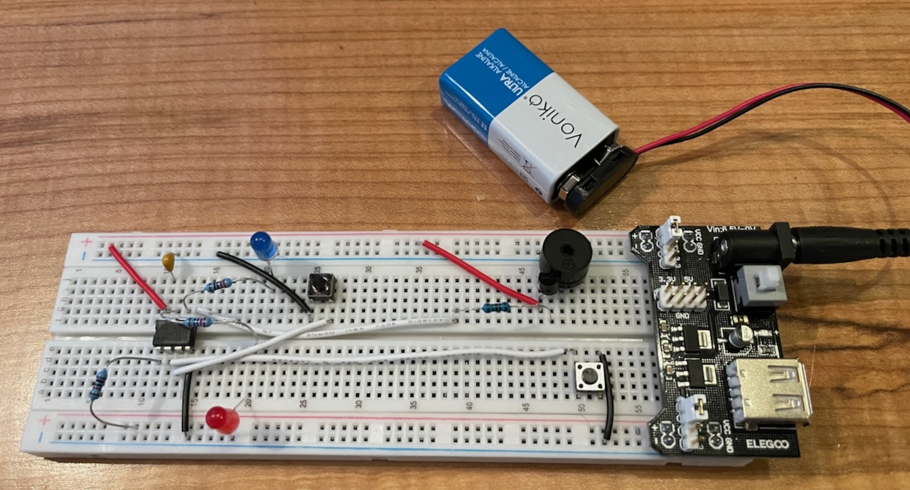

# A "Reaction Game" for the ATTiny85 (and Arduino Uno)

## Overview
This circuit (and accompanying program) creates a simple "reaction game" for two players.

1. When the circuit is energized, lights flash and a tune plays. 
2. The game begins when both players click their buttons simultaneously. 
3. 5-7 seconds later, both LED lights will turn on. 
4. Whoever hits their button first wins. (Their light will turn on).
5. Watch out! If you hit your button early, you will lose.
6. The game can be restarted. (See step 2).

### History
A few weeks ago I bought an Arduino kit online. This is my **first electronics project** outside of the kit examples.

### Goals for this project:
1. Run on a breadboard, powered by just a 9-volt battery.
2. Use the ATTiny85 chip. (I was initially under the mistaken impression that I couldn't power the Uno with a 9volt battery ... but anyway, I'm glad I used the ATTiny85 for this project).

### Supported platforms
1. Arduino Uno
2. ATTiny85 (using the Uno as an ISP programmer)

### Requirements
This project is made for VSCode/Platform.io. You'll need to install those first.

### Programming the ATTiny85
I used [this guide](https://homemadehardware.com/guides/programming-an-attiny85/) to set up my Uno as an ISP programmer. You should disconnect the ATTiny85 from the circuit prior to programming. (Or you can disconnect part of the circuit, which is what I did ;).

## Wiring diagrams
### ATTiny85 

### Arduino Uno
(Pending)

* Wire up the same as the ATTiny85 except using the following pins:
  * BUZZER_PIN = 10; 
  * PLAYER_1_LED = 5;
  * PLAYER_2_LED = 6; 
  * PLAYER_1_BUTTON = 4; 
  * PLAYER_2_BUTTON = 3; 
* You can connect the buzzer directly to pin 10 (no need for the transistor).
* Ignore the 0.1uf capacitor connected to VCC.
* Ignore connecting the chip to ground ... the chip that powers your Uno is already connected to ground.

## Design Notes
### I thought there were 6 I/O pins on the ATTiny85
I initially wanted to have 3 leds: One for each of the players, and a third one as a neutral signal. But, I realized that the 6th I/O pin on the ATTiny85 shares general I/O with reset and if you want to use the pin for general I/O, you must disable reset, which in turn makes the chip no longer programmable. (Unless you first reset the fuse bit using a [high voltage programmer](http://www.peterfleury.epizy.com/avr-hvsp-fuse-restore.html).)

### I needed to add a transistor to drive the buzzer
The passive buzzer I have is specified to require less than 30 mA. The ATtiny85 is capable of delivering 40 mA to each of its pins. However, I encountered intermittent startup problems. I added a transistor to drive the buzzer with VCC, which rectified the issue. Further internet investigation revealed that the buzzer may exhibit "capacitive characteristics", leading me to theorize that it either initially draws more than 40 mA or it draws current in a sudden manner (is that a thing?), destabilizing the ATtiny85.

### Pin Change Interrupts
The Uno supports per-pin hardware interrupts. But the ATTiny85 does not, so you have to use "pin change interrupts". I used a library called "EnableInterrupt" to make my code a bit more idiomatic.

### nbDelay
Since this was my first Arduino program, I wasn't sure the best way to structure it. I opted for a finite state machine to drive game state with interrupts changing state. But, when I play sounds or flash lights I need to "wait" for some duration. The way this is done in the Arduino examples I saw is to use `delay(..)`. But `delay(..)` blocks and so state change would not happen immediately. So I implemented `nbDelay(..)` to be a non-blocking delay. `nbDelay(..)` returns quickly if there is an interrupted state-change.

## For the future
* I'd like to measure the current spike for the buzzer when the program first starts and see its shape and whether it is higher than 40ma.
* If I can think of some nice housing for the buttons, I wouldn't mind bringing them off the board so players can play further away from each other.
* I'm interested in learning more about how to structure code for things like this. I can think of a number of ways to drive game state and have it be interruptible, but I wonder which are the most idiomatic.
